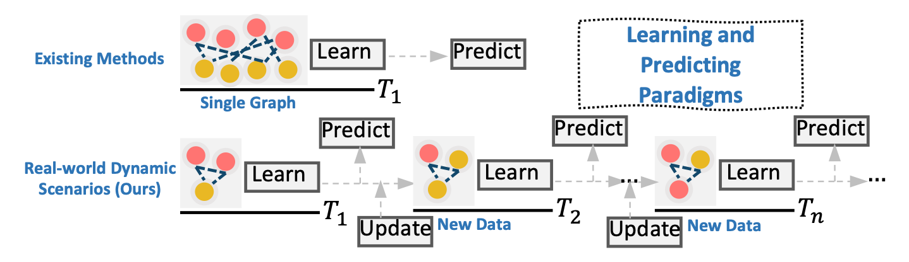

# GraphPro, WWW'2024


[](LICENSE)

## Introduction

GraphPro is a repository containing the source code for the research paper titled [**"GraphPro: Graph Pre-training and Prompt Learning for Recommendation"**](https://arxiv.org/abs/2311.16716). Our work focuses on graph-based recommendation systems in **dynamic** settings and explores graph **pre-training** and **prompt learning** techniques.



🌟🌟 In this repository, we include the following resources to help reproducing, benchmarking and further studying:
- Implementation of GraphPro (and GraphPro as plug-in)
- Implementation of dynamic GNNs and prompt GNNs as the baselines we use
- Preprocessed datasets for dynamic graph-based recommendation: Taobao, Koubei and Amazon
- Pre-trained weights of GraphPro and LightGCN on all the datasets

## Datasets
Our preprocessed datasets are provided in `dataset/`. User and item interactions are split into pre-training and fine-tuning snapshots.

## How to Run
### Dependencies
We summarize our used packages in `requirements.txt`. We build the environment under `Python 3.10.8`.
### Pre-training
**🌟🌟 We alrealy included the pre-trained model weights of GraphPro and LightGCN in `pretrained_weights/` to assist extremely convenient using and reproducing. :) Along with the weights we also provide pre-training logs.**

To pre-train the models from scratch, the main file for pre-training is ```pretrain.py```. You can run graph pre-training on the datasets by the following commands:
```
# Taobao
python pretrain.py --data_path dataset/taobao --exp_name pretrain --phase pretrain --log 1 --device cuda:0 --model GraphPro --lr 1e-3 --edge_dropout 0.5 

# Koubei
python pretrain.py --data_path dataset/koubei --exp_name pretrain --phase pretrain --log 1 --device cuda:0 --model GraphPro --lr 1e-3 --edge_dropout 0.2 --hour_interval_pre 24 

# Amazon
python pretrain.py --data_path dataset/amazon --exp_name pretrain --phase pretrain --log 1 --device cuda:0 --model GraphPro --lr 1e-3 --edge_dropout 0.2 --hour_interval_pre 24 
```

### Fine-tuning
**🌟🌟 The training logs for fine-tuning are provided in `saved/[dataset]/finetune/train_log.txt` for your reference during reproducing and debugging. :)**

To fine-tune with the pre-trained weights, the main file is `finetune.py`. Relevant commands are:
```
# Taobao
python finetune.py --data_path dataset/taobao --exp_name finetune --log 1 --device cuda:0 --pre_model_path pretrained_weights/GraphPro_Taobao_pretrained.pt --pre_model GraphPro --f_model GraphPro --lr 1e-3 --edge_dropout 0.5 --samp_decay -0.05 

# Koubei
python finetune.py --data_path dataset/koubei --exp_name finetune --log 1 --device cuda:0 --pre_model_path pretrained_weights/GraphPro_Koubei_pretrained.pt --pre_model GraphPro --f_model GraphPro --lr 1e-3 --edge_dropout 0.2 --hour_interval_pre 24 --hour_interval_f 24 --updt_inter 2 --samp_decay 0.1

# Amazon
python finetune.py --data_path dataset/amazon --exp_name finetune --log 1 --device cuda:0 --pre_model_path pretrained_weights/GraphPro_Amazon_pretrained.pt --pre_model GraphPro --f_model GraphPro --lr 1e-3 --edge_dropout 0.2 --hour_interval_pre 24 --hour_interval_f 24 --updt_inter 4 --samp_decay -0.1 
```

### As a plug-in on other models
Please find how we effectively implement GraphPro on other models in `modules\plugins`. To run relevant experiments, simply specify `--plugin` and change `--pre_model [your_model] --f_model [your_model]` in your command arguments when running `finetune.py`, and the script would automatically import the implemented model with GraphPro as plug-in by the following codes:
```
if args.plugin:
    modules_class = "modules.plugins."
```

For example, to run SimGCL with GraphPro, the command is:
```
python finetune.py --data_path dataset/taobao --exp_name finetune --log 1 --device cuda:0 --pre_model_path [your_pretrained_weights] --pre_model SimGCL --f_model SimGCL --lr 1e-3 --edge_dropout 0.5 --samp_decay -0.05 --plugin
```

### Run Baselines -- Dynamic GNNs and Prompt GNNs
We have included our implementation of dynamic GNNs and prompt GNNs in `modules\dynamicGNN` and `modules\graphprompt`. The main files for the baselines are `finetune_dynamic.py` and `finetune_graphprompt.py`. We give two examples on how to reproduce the results for the baseline models:
```
python finetune_dynamic.py --data_path dataset/taobao --exp_name roland --device cuda:0 --log 1 --pre_model_path pretrained_weights/LightGCN_Taobao_pretrained.pt --f_model roland 

python finetune_graphprompt.py --data_path dataset/taobao --exp_name graphprompt --device cuda:0 --log 1 --pre_model_path pretrained_weights/LightGCN_Taobao_pretrained.pt --f_model graphprompt 
```

## Cite
Please kindly cite our paper if you find our work, codes or data useful:
```
@article{yang2023graph,
  title={GraphPro: Graph Pre-training and Prompt Learning for Recommendation},
  author={Yang, Yuhao and Xia, Lianghao and Luo, Da and Lin, Kangyi and Huang, Chao},
  journal={arXiv preprint arXiv:2311.16716},
  year={2023}
}
```
<!-- Add citation information for the research paper here. -->
